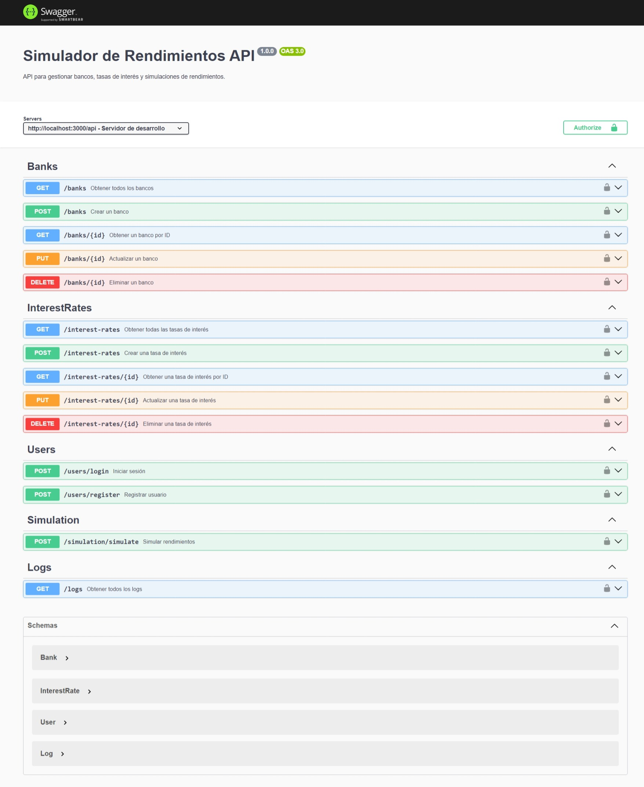

# Simulador de Rendimientos API

Este proyecto es un backend desarrollado en **Node.js** utilizando **Express** y **TypeScript** para gestionar bancos, tasas de interés y simulaciones de rendimientos. Incluye documentación interactiva con Swagger, pruebas automatizadas y un sistema de seeds para datos iniciales.

---

## **Requisitos Previos**

- **Node.js**: Versión 22 o superior.
- **pnpm**: Gestor de paquetes (alternativa a npm).
- **MySQL**: Base de datos relacional.

---

## **Instrucciones de Instalación**

1. **Clonar el Repositorio:**
   ```bash
   git clone https://github.com/Primo18/simulador-rendimientos.git
   cd simulador-rendimientos
   ```

2. **Instalar Dependencias:**
   ```bash
   pnpm install
   ```

3. **Configurar el Entorno:**
   Crea un archivo `.env` en la raíz del proyecto con los siguientes valores:

   ```env
   DATABASE_HOST=localhost
   DATABASE_USER=root      # Cambiar por el usuario de MySQL de tu sistema
   DATABASE_PASSWORD=root  # Cambiar por la contraseña de MySQL de tu sistema
   DATABASE_NAME=simulador

   PORT=3000
   JWT_SECRET=secret
   JWT_EXPIRES_IN=3h
   ```

4. **Inicializar la Base de Datos:**
   Ejecuta el script de seeds para poblar la base de datos con datos iniciales:
   ```bash
   # Crear la base de datos manualmente en MySQL con el nombre especificado en el archivo .env (DATABASE_NAME) antes de ejecutar el seed. Por defecto: simulador.
   pnpm seed
   ```

5. **Iniciar el Servidor:**
   ```bash
   pnpm dev
   ```
   El servidor se iniciará en: `http://localhost:3000`

---

## **Estructura del Proyecto**

```plaintext
src/
├── controllers/      # Controladores de rutas
├── database/         # Configuración de la base de datos
├── models/           # Definición de modelos con Sequelize
├── routes/           # Definición de rutas de la API
├── services/         # Lógica del negocio
├── seeds/            # Script para poblar datos iniciales
├── utils/            # Utilidades (helpers)
├── config/           # Configuraciones (Swagger, etc.)
└── app.ts            # Punto de entrada principal
```

- **`controllers`**: Manejan las peticiones HTTP y delegan lógica a los servicios.
- **`models`**: Define la estructura de las tablas y relaciones con Sequelize.
- **`services`**: Contiene la lógica del negocio.
- **`routes`**: Define las rutas de la API.
- **`seeds`**: Crea datos iniciales para la base de datos.

---

## **Documentación de la API con Swagger**

La documentación interactiva de la API está disponible en:

```
http://localhost:3000/api-docs
```


### **Rutas Principales**

#### **Usuarios**
- **POST /api/users/login**: Iniciar sesión y obtener un token JWT.
- **POST /api/users/register**: Registrar un nuevo usuario.

#### **Bancos**
- **GET /api/banks**: Obtener todos los bancos.
- **POST /api/banks**: Crear un nuevo banco.
- **GET /api/banks/{id}**: Obtener un banco por ID.
- **PUT /api/banks/{id}**: Actualizar un banco por ID.
- **DELETE /api/banks/{id}**: Eliminar un banco por ID.

#### **Tasas de Interés**
- **GET /api/interest-rates**: Obtener todas las tasas de interés.
- **POST /api/interest-rates**: Crear una nueva tasa de interés.
- **GET /api/interest-rates/{id}**: Obtener una tasa de interés por ID.
- **PUT /api/interest-rates/{id}**: Actualizar una tasa de interés por ID.
- **DELETE /api/interest-rates/{id}**: Eliminar una tasa de interés por ID.

#### **Simulación**
- **POST /api/simulation/simulate**: Simular rendimientos financieros.

#### **Logs**
- **GET /api/logs**: Ver los logs de acciones (protegido para `ADMIN`).

---

## **Modelo MER de la Base de Datos**

[](https://mermaid.live/edit#pako:eNqtU0FuwjAQ_IrlM3wgt1aoEmoroVZcqly28SZYxN5ovS5FkL_XaaAE0kNR8cXambE9s7Z3uiCDOtPIMwsVg8u9SmMZkIPa9UU3rBeskJU1avF4goOw9ZWKSe7BoVqOuQZC2BCbEcFU4wkU6zAIuEYVjCBo7uQ3MjZmSLb99ETVFW6hEEt-rO5SzI16GKwQ_BTVMH5YimEGAheUx80F-p8Y9-DXV-ToOj4OZwxjCCO8IC8p-I2czpOxdIy8JO4vjo_we0p40eKyJhAF3keoF8gFJp_VIFd3vKohyDMZW1o0N4rQP_H9fjqlXf-AMpXrFQTlwG9zPbySg-o89blcT7RDdmBN-k3fDcm1rDDdkO6EBnjd7dkmHUSh160vdCYccaKZYrXSWQl1SFXv9vAbf9AG_BvRsW6_APc8KUw)

---

## **Seed de Datos Iniciales**

El proyecto incluye datos iniciales:

### **Usuarios**
- `admin` (rol: `ADMIN`, contraseña: `admin123`).
- `user` (rol: `USER`, contraseña: `user123`).

### **Bancos**
- Banco de Chile.
- Banco Estado.
- Santander Chile.
- Banco BCI.
- Scotiabank Chile.

### **Tasas de Interés**
- Asociadas a los bancos anteriores.

Ejecuta el seed para poblar estos datos:
```bash
pnpm seed
```
